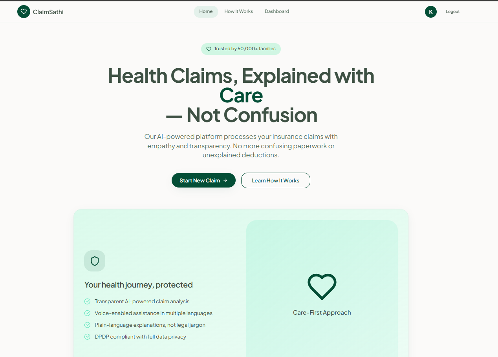
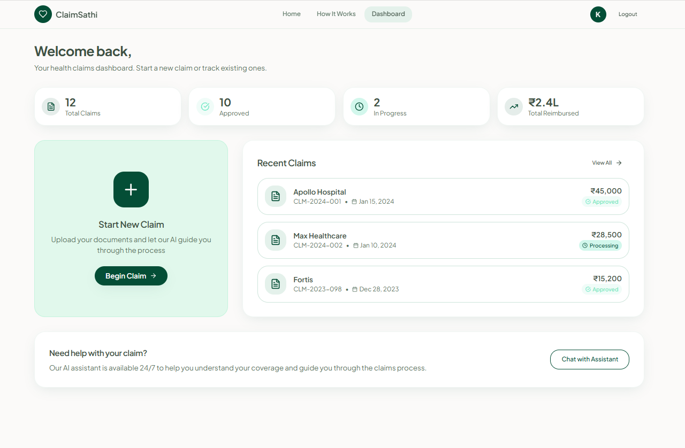
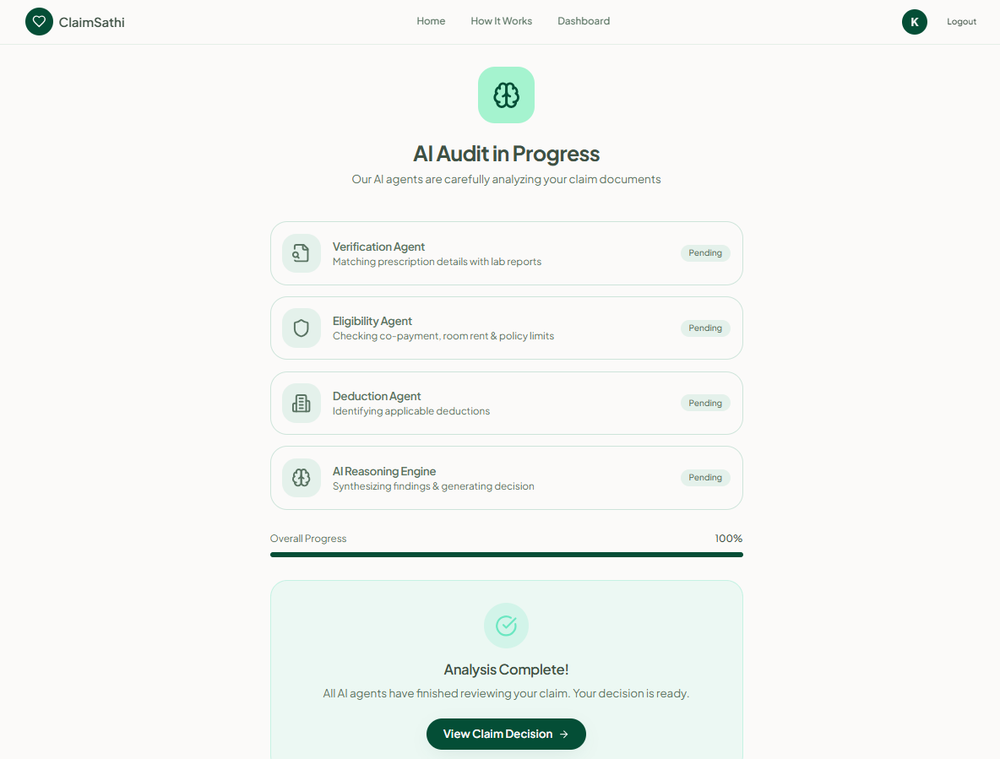
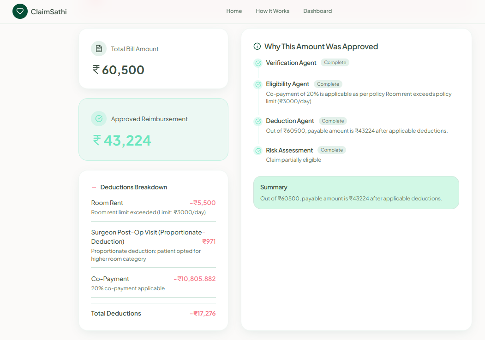

# ClaimSathi: Agentic AI Health Insurance Claim Assistance System

## 📌 Overview

ClaimSathi is an Agentic AI-powered health insurance claim assistance system designed to simulate intelligent claim evaluation. The system leverages Large Language Models (LLMs), vector embeddings, and modular AI agents to analyze medical documents and generate structured claim eligibility insights.

Unlike traditional rule-based systems, ClaimSathi follows an agentic architecture where specialized AI components collaborate to extract, reason, validate, and produce contextual claim decisions.

---

## 🎯 Problem Statement

Health insurance claims are often complex, document-heavy, and difficult for policyholders to interpret. Manual document review is time-consuming and prone to inconsistencies.

ClaimSathi aims to simplify this process by:

- Automating document understanding
- Applying contextual reasoning over policy clauses
- Providing structured claim eligibility insights
- Acting as an AI-based decision-support system

---

## 🤖 Agentic AI Architecture

ClaimSathi follows an Agentic AI framework where multiple intelligent modules perform specialized tasks.

### Key AI Agents

- **Document Extraction Agent**  
  Extracts and preprocesses text from uploaded medical and claim documents.

- **Embedding & Retrieval Agent**  
  Converts text into vector embeddings and performs semantic similarity search over relevant policy information.

- **Reasoning Agent (LLM-powered)**  
  Applies contextual reasoning over medical records and policy clauses.

- **Decision Structuring Agent**  
  Generates structured output including eligibility status and reasoning explanation.

This modular architecture improves explainability, scalability, and maintainability.

---

## 🚀 Key Features

- Upload and analyze medical claim documents
- Agent-based modular AI pipeline
- Context-aware reasoning using LLM
- Vector embedding-based semantic retrieval
- Structured claim analysis output
- Decision-support oriented system design
- Scalable backend architecture

---

## 🛠️ Tech Stack

**Frontend:** React.js / HTML / CSS  
**Backend:** Node.js / Express.js  
**AI Model:** gemini-2.5-flash
**Framework:** LangChain  
**Embeddings:** Vector-based semantic embeddings  
**Database:** MongoDB 

---

## 🏗️ System Workflow

1. User uploads medical claim documents.
2. Document Extraction Agent processes raw text.
3. Text is converted into vector embeddings.
4. Retrieval Agent fetches relevant policy clauses.
5. LLM-based Reasoning Agent evaluates eligibility contextually.
6. Structured claim analysis report is generated.

---

## 📂 Project Structure

```
ClaimSathi/
│
├── frontend/
├── backend/
├── controllers/
├── services/
├── agents/
├── utils/
├── models/
├── assets/
└── README.md
```

---

## ⚙️ Installation Guide

### Clone the repository

```bash
git clone https://github.com/NehaYadav1505/ClaimSathi-Health-Insurance-Claim-Assistance.git
```

### Install dependencies

Backend:

```bash
npm install
```

Frontend:

```bash
npm install
```

### Run the application

```bash
npm start
```

or

```bash
node server.js
```

---

## 💻 Usage

1. Start backend server.
2. Launch frontend application.
3. Upload medical claim-related documents.
4. Receive AI-generated structured claim analysis and eligibility insights.

---

## 📸 Application Preview

### Home


### Dashboard


### Agentic Analysis


### Claim Analysis Output


---

## ⚠️ Limitations

- Functions as a decision-support system, not a real claim approval system.
- Not integrated with real insurance provider databases.
- Output depends on document clarity and input completeness.
- No real-time regulatory compliance validation.

---

## 🔮 Future Enhancements

- Multi-agent fraud detection module
- Real-time integration with hospital systems
- Fine-tuned insurance-domain LLM
- Multi-policy comparison engine
- Multi-language claim analysis
- Explainable AI reasoning layer

---

## 📚 Concepts Demonstrated

- Agentic AI design principles
- Retrieval-Augmented Generation (RAG)
- Vector similarity search
- Context-aware LLM reasoning
- Modular backend architecture
- Decision-support system modeling

---

## 👩‍💻 Author

Neha Yadav  
LinkedIn: www.linkedin.com/in/neha-yadav-643104277  

---

## 📄 License

This project is developed for academic, research, and demonstration purposes.
